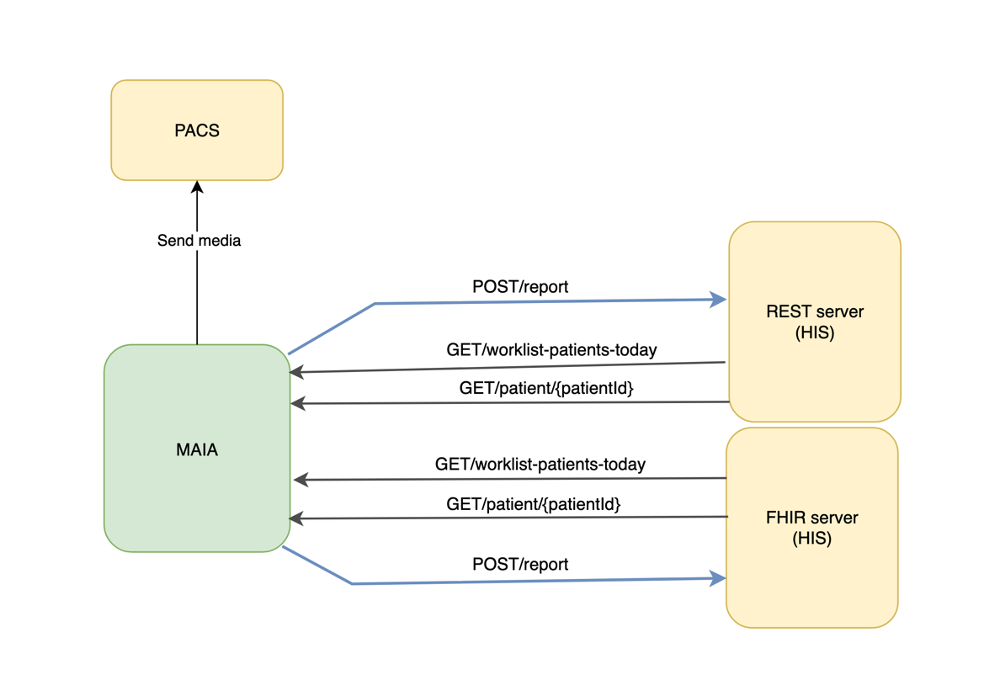
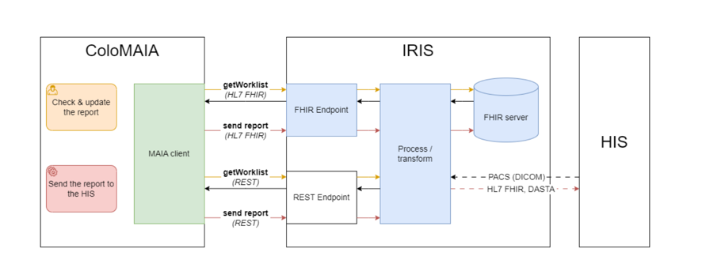

# MAIA LABS

Maia Labs develops the intelligent endoscopic module ColoMaia, leveraging AI to enhance polyp detection, automate
medical reports, and optimize video storage. The system is compatible with any endoscopic tower and integrates with
hospital systems, improving diagnostic accuracy and saving doctors' time. To see more about Maia Labs, visit our
website [maialabs.com](https://maia-labs.com).

Maia is capable of communicating with third-party systems via REST/FHIR and seamlessly integrates with PACS platforms.

## API Documentation

Click here to view the Swagger documentation:
[Swagger UI](https://editor.swagger.io/?url=https://raw.githubusercontent.com/maia-labs-dev/mbox-api/main/api/maia-lab-swagger-new.json)

----

## Third party integration

## FHIR/REST Integration with IRIS

