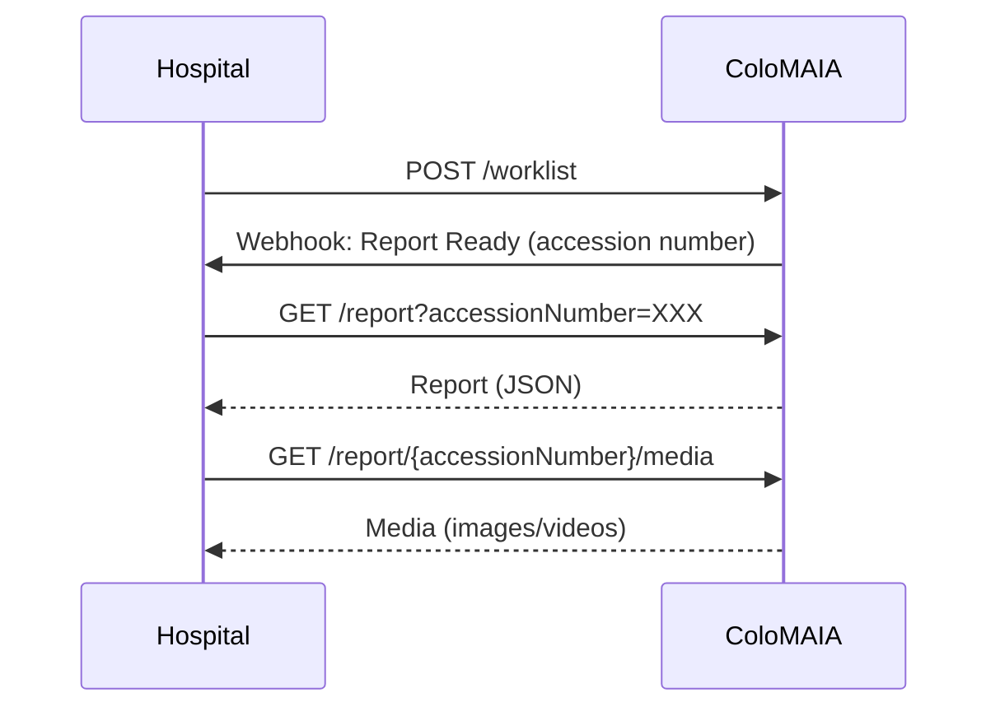

# MAIA LABS API

Maia Labs develops the intelligent endoscopic module ColoMaia, leveraging AI to enhance polyp detection, automate
medical reports, and optimize video storage. The system is compatible with any endoscopic tower and integrates with
hospital systems, improving diagnostic accuracy and saving doctors' time. To see more about Maia Labs, visit our
website [maia-labs.com](https://maia-labs.com).

----

## Integration Workflow



### Workflow Steps

1. **Push WorkList**: Hospital pushes patient worklist to ColoMAIA via `POST /worklist`
2. **Report Ready Notification**: ColoMAIA sends webhook notification when a report is ready (includes accession number)
3. **Get Report**: Hospital retrieves the report JSON from ColoMAIA via `GET /report?accessionNumber={accessionNumber}`
4. **Download Media**: Hospital retrieves associated images/videos via `GET /report/{accessionNumber}/media`

----

## Integration Guide

### Getting Started

- **Base URL**: Provided during onboarding (environment-specific)
- **Authentication**: HTTP Basic Auth (credentials provided during onboarding)
- **Format**: All requests/responses use JSON (UTF-8), except media downloads which return ZIP archives

### Report Notification: Webhook Integration

ColoMAIA uses **webhooks** to notify your system when a report is ready.
A webhook is an HTTP callback that ColoMAIA sends to your server.

#### Setting Up Your Webhook Endpoint

**You must implement** a webhook endpoint on your server that ColoMAIA will call:

```
POST https://your-server.com/webhook/report-ready
Content-Type: application/json
```

**Request Body** (sent by ColoMAIA):

```json
{
  "accession_number": "2024-12345",
  "status": "final",
  "timestamp": "2026-01-29T14:30:00Z"
}
```

**Your Response** (return immediately):

```json
HTTP/1.1 200 OK
```

#### Implementation Requirements

1. **Endpoint Registration**: Register your webhook URL via `POST /webhook` or provide it during onboarding
2. **Accept POST Requests**: Your endpoint must accept POST with JSON payload
3. **Return 200 OK**: Respond with HTTP 200 status code within 10 seconds
4. **Process Asynchronously**: Store the notification and retrieve the report in background
5. **Handle Retries**: ColoMAIA retries failed calls (3 attempts with exponential backoff)

#### Example Webhook Handler

```python
@app.route('/webhook/report-ready', methods=['POST'])
def webhook_report_ready():
    # 1. Parse payload
    data = request.json
    accession_number = data['accession_number']
    status = data['status']
    
    # 2. Queue report retrieval (async processing)
    queue_report_download(accession_number, status)
    
    # 3. Return 200 OK immediately
    return '', 200
```

#### Webhook Lifecycle

1. **Report Ready**: ColoMAIA completes report generation
2. **Webhook Sent**: ColoMAIA POSTs notification to your endpoint
3. **You Respond**: Your endpoint returns 200 OK (within 10s)
4. **You Retrieve**: Fetch report via `GET /report?accessionNumber={accessionNumber}`
5. **You Store**: Persist report in your system (ColoMAIA purges after 24h)

#### Managing Webhook Endpoints

You can register, update, and delete webhook endpoints programmatically:

**Register or Update Webhook**:

```
POST /webhook
Content-Type: application/json

{
  "url": "https://your-server.com/webhook/report-ready",
  "description": "Production webhook for report notifications"
}
```

**Get Current Webhook Configuration**:

```
GET /webhook
```

**Response**:

```json
{
  "url": "https://your-server.com/webhook/report-ready",
  "status": "active",
  "last_tested": "2026-01-29T10:00:00Z",
  "last_delivery": "2026-01-29T14:30:00Z",
  "description": "Production webhook for report notifications"
}
```

**Remove Webhook**:

```
DELETE /webhook
```

**Webhook Status Values**:

- `active` - Working correctly, receiving notifications
- `inactive` - Not tested yet or no recent deliveries
- `failed` - Last delivery attempt failed (check endpoint accessibility)

#### Alternative: Polling (If Webhook Not Feasible)

If webhook implementation is not possible:

- Poll `GET /report?accessionNumber={accessionNumber}` every 5-10 minutes post-examination
- Continue for up to 2 hours after scheduled examination time
- Stop once report retrieved (200 OK)
- Implement exponential backoff to respect rate limits

### Media Attachments

Reports include diagnostic images and video recordings. Media is retrieved separately from the report text:

#### Downloading Media

```
GET /report/{accessionNumber}/media
```

**Response**: ZIP archive containing all media files for the examination

**Media Details**:

- **Format**: ZIP file containing JPEG images and MP4 videos
- **Size**: Typically 10MB - 2GB per examination
- **Retention**: Available for 24 hours after webhook notification (GDPR compliance)
- **Naming**: Files named with timestamps

**Example**:

```
report_media_2024-12345.zip
├── image-2026-01-29T14-30-15-00.jpg
├── image-2026-01-29T14-31-02-00.jpg
├── video-2026-01-29T14-32-45-00.mp4
└── image-2026-01-29T14-35-20-00.jpg
```

### Key Requirements

**Worklist Data**:

- **Required**: `accession_number`, `patient_id`
- **Optional**: `given_name`, `surname`, `birth_date` (YYYY-MM-DD), `examination_schedule` (ISO 8601 date-time), `modality`
- Max 100 patients per worklist push

**Report Lifecycle**:

- Reports and media must be retrieved within 24 hours of webhook notification (GDPR compliance)
- Retrieve and store reports in your system immediately upon webhook notification
- Preliminary reports may be followed by final reports (separate webhook notifications)
- Reports can be retrieved multiple times within the 24-hour window
- After 24 hours, reports and media may be purged based on data retention policies
- 404 error if accession number not found, 410 if report expired

**Timezones**: All timestamps in ISO 8601 format with timezone.

### Error Responses

| Code | Meaning | Action |
|------|---------|--------|
| 400 | Invalid request format | Check payload structure against Swagger spec |
| 404 | Report not found | Verify accession number or wait for webhook |
| 410 | Report expired | Re-request or contact support |
| 429 | Rate limit exceeded | Implement exponential backoff (max 100 req/min) |
| 500 | Server error | Retry after 30s, contact support if persists |

**Error Format**:

```json
{
  "error": "Error description",
  "code": "ERROR_CODE",
  "details": "Additional context (optional)"
}
```

----

### API Documentation

- [Swagger Editor](https://editor.swagger.io/) – upload or paste the contents of [api/colomaia.json](api/colomaia.json)
