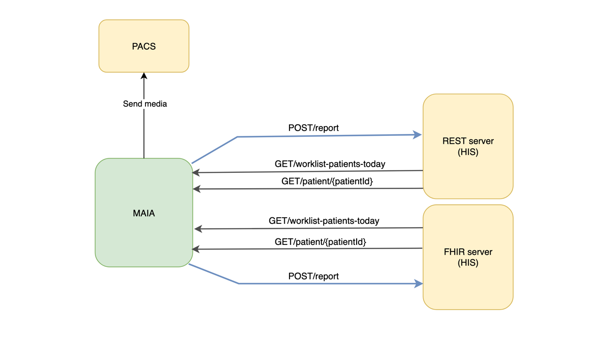

# API Documentation

Click here to view the Swagger documentation:
[Swagger UI](https://editor.swagger.io/?url=https://raw.githubusercontent.com/maia-labs-dev/mbox-api/main/api/maia-lab-swagger-new.json)

----

Maia is capable of communicating with third-party systems via REST/FHIR and seamlessly integrates with PACS platforms.

# Third party integration

# FHIR/REST Integration with IRIS

